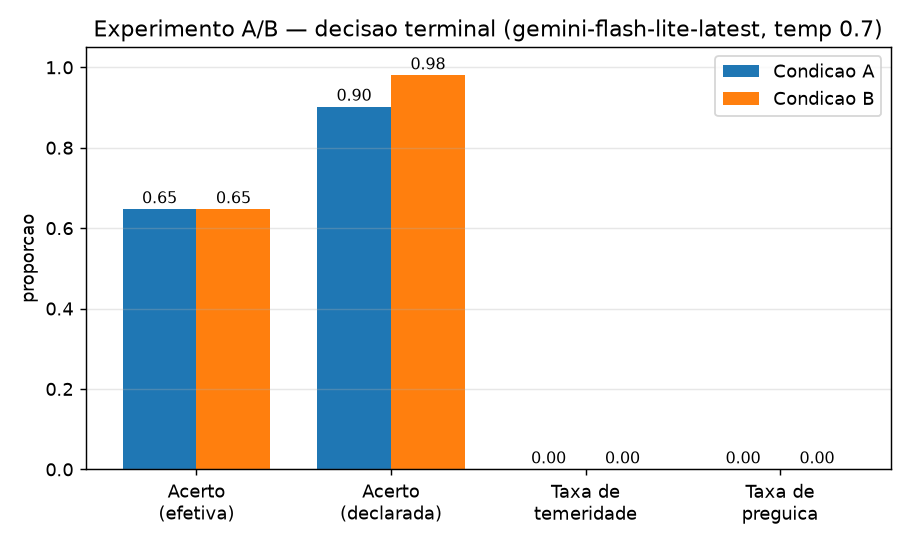

# Agente de suporte industrial + framework de avaliação — Case TRACTIAN / Inteli

Projeto individual. Sobre a API FastAPI fornecida (dados sintéticos de monitoramento
de vibração), este repositório entrega:

1. **Um agente single-turn** que resolve chamados de suporte industrial via
   tool-calling nativo (18 ferramentas 1:1 com os endpoints).
2. **Um framework mínimo de avaliação** com um experimento controlado A/B sobre
   uma cláusula do prompt do sistema.

> **Para avaliação — não é preciso rodar nada.** O experimento completo já está
> versionado: **`results/`** (`summary_A_vs_B.md`, `comparison.png`,
> `confusion_{A,B}.csv`, `scores.csv`, `episodes.jsonl`, `run_config.json`) e
> **`traces/`** (1 JSONL por episódio, com o payload completo de cada chamada à
> API). A Seção 7 resume os números. Reexecutar (`bash run.sh experiment`) exige
> uma chave LLM com cota diária disponível — ver Seção 5.

---

## 1. Problema

O time de suporte da TRACTIAN recebe chamados ("o ativo quebrou e não fui
avisado", "esse insight parece falso", "qual o procedimento de troca de
rolamento?"). Responder bem exige investigar o estado do ativo na plataforma
(configuração, baseline, análise automática, RMS, espectro, qualidade de dados,
cobertura do modelo), respeitar permissões e regras de negócio, e escolher a
conduta certa: **orientar**, **agir** (reprocessar / pedir análise
especializada / ação de alto impacto) ou **escalar para um humano**.

O objetivo é um agente que faça esse ciclo sozinho a partir de **uma** mensagem
de entrada, e um método para medir **quão bem** ele decide — em particular se ele
age além do que deveria (temeridade) ou escala o que era resolvível (preguiça).

## 2. Trilha e recorte

Trilha: **agente + avaliação** (Partes 1 e 2 do enunciado).

Recorte consciente:

- Interação **single-turn**: uma mensagem entra, o agente investiga e decide. Sem
  conversa, sem elicitação.
- **Um único modelo, uma única configuração** (registrados em
  `results/run_config.json`).
- Experimento **A/B** sobre uma cláusula do prompt, não uma varredura de
  hiperparâmetros.
- Fora de escopo por decisão explícita: servidor MCP, grafo de estados /
  LangGraph, simulador de usuário, LLM-as-a-judge, classificador de tom, UI.

## 3. Arquitetura

```
inteli-tractian-project/       API FastAPI fornecida (intacta) + agent-input/ + eval/
agent/
  client.py     cliente HTTP fino: header x-user-id, ?seed, normalização de
                /users/me, gravação de trace JSONL a cada chamada
  llm.py        isola o provedor LLM (interface OpenAI-compatível) + pacing de rate limit
  tools.py      18 schemas de ferramenta (visão única do agente) + dispatch -> client
  prompts.py    SYSTEM_BASE (condição A)  +  CLÁUSULA_CONDICAO_B
  agent.py      laço de tool-calling: teto de 8 chamadas, detector de laço,
                saída final estruturada (JSON no último turno, parse tolerante)
  run_case.py   CLI para rodar 1 caso
eval/
  expected-decisions.json   gabarito curado de decisão terminal (QUARENTENADO)
  oracle.py     pontua 1 episódio: decisão terminal / cobertura de trajetória / ancoragem
  runner.py     percorre 17 casos x {A,B} x N trials; resumível; não trava se 1 episódio falha
  analyze.py    tabelas (pandas) + matriz 5x5 + gráfico de barras (matplotlib) + veredito H1
  test_quarantine.py   garante que agent/ nunca referencia o gabarito
traces/         1 arquivo JSONL por episódio (payload cheio de cada chamada)
results/        episodes.jsonl, scores.csv, summary_A_vs_B.md, comparison.png, run_config.json
```

### Fluxo de um episódio

`runner` → `agent.run_episode(caso, condição, trial, seed)` → monta o system
prompt (A ou B) + a mensagem do chamado → laço: o modelo chama ferramentas
(máx. 8; detector de laço corta repetição idêntica; ao atingir o orçamento
prático `AGENT_CALL_BUDGET` o laço para e força a decisão final) → cada chamada
passa pelo `ApiClient`, que grava o trace → o modelo
emite a decisão final num bloco `json` → `run_episode` deriva a **decisão
efetiva** do trace (qual ação foi de fato aceita pela API) e grava o episódio.


## 4. Instalação e execução

Pré-requisitos: Python 3.10+ (testado em 3.12), uma chave de LLM
OpenAI-compatível.

```bash
# 1. ambiente + API + dados
bash run.sh setup           # cria .venv, instala deps, gera data/ agent-input/ eval/, sobe a API

# 2. credencial
cp .env.example .env        # preencha GROQ_API_KEY (ou outro provedor OpenAI-compatível)

# 3. experimento (17 casos x A/B x N trials) — resumível
bash run.sh experiment      # escreve results/episodes.jsonl + traces/

# 4. análise
bash run.sh analyze         # escreve results/summary_A_vs_B.md + comparison.png
```

Rodar um caso isolado:

```bash
.venv/bin/python -m agent.run_case --case case_tkt_inv_04 --condition A --trial 1
```

Testes:

```bash
.venv/bin/python -m pytest inteli-tractian-project/api   # 39 testes da API fornecida
.venv/bin/python -m pytest eval/test_quarantine.py       # quarentena do gabarito
```

## 5. Modelos e configurações

| item | valor |
|---|---|
| provedor | endpoint OpenAI-compatível; `agent/llm.py` isola o provedor |
| modelo | `gemini-flash-lite-latest` (Google, via shim OpenAI) |
| temperatura | **0.7** (fixa) |
| tool-calling | nativo do SDK (`tools` / `tool_choice=auto`), 18 ferramentas |
| teto de chamadas | 8 (hard) + orçamento prático de 6 leituras (`AGENT_CALL_BUDGET`) antes de forçar a decisão final; detector de laço |
| seed da API | **`complete`** (fixa p/ todos os casos; os overrides de `data/seed.json` continuam valendo — ex.: RMS do G-501 segue `unavailable`) |
| trials por caso | ver `results/run_config.json` |

**Nota sobre o modelo (odisseia de rate limit).** O plano era
`openai/gpt-oss-120b` (Groq). Ao longo do desenvolvimento os limites **diários**
de token dos free tiers foram esgotados, um a um: `gpt-oss-120b` (200k
tokens/dia), depois `gpt-oss-20b` em 3 contas Groq distintas (200k/dia cada),
depois `gemini-2.5-flash` (cota diária). A rodada final usou
**`gemini-flash-lite-latest`** — cota diária ainda disponível, ~1000 req/dia,
tool-calling nativo. `agent/llm.py` isola o provedor e faz round-robin de
chaves + fallback de rate limit; trocar de modelo/provedor é uma linha do
`.env`, sem mudança de código.

**Por que `temperature=0.7` e não 0:** o determinismo do experimento vem da
**seed fixa da API** (mesma seed ⇒ mesmos dados, sempre). Com `temperature=0` os
3 trials de um caso seriam quase idênticos e `pass^k` colapsaria em `pass^1`,
esvaziando a métrica de consistência. Com 0.7, a variação entre trials
idênticos é justamente o que `pass^k` mede.

**Por que `seed=complete`:** força `mode=complete` em tudo que não tem override
de cenário em `data/seed.json`, reproduzindo a condição limpa com que os
cenários foram desenhados; os overrides (G-501, S-420, M-205, M-605, V-301,
M-208, C-710) seguem impondo seus modos degradados. Resultado: dados
determinísticos por caso, sem ruído de modo aleatório.

## 6. Metodologia experimental

**Hipótese H1.** Impor a verificação do estado do baseline antes de aceitar um
insight reduz a taxa de decisões **temerárias** (agir além do devido) sem
aumento proporcional de **escalonamento indevido**.

**Condição A** — prompt base (`SYSTEM_BASE`): papel, data de referência
2026-07-14, obrigação de `get_me` antes de agir, as 5 decisões terminais,
citação de evidência concreta, regra de justificativa ≥ 20 caracteres, proibição
de afirmar o que o envelope não entregou.

**Condição B** — prompt base **+ cláusula**: "antes de aceitar um insight como
confiável, verifique `baseline.state` e `detection_mode`; falhas por desvio
(imbalance, misalignment, bearing_fault, electrical_fault, looseness) exigem
baseline `established`; falhas sintomáticas (lubrication) não exigem."

**Desenho.** 17 casos × 2 condições × N trials, seed fixa por caso
(`complete`). Ordem de execução trial→condição→caso, para que um corte precoce
mantenha cobertura completa em profundidade menor de trials. Runner resumível;
um episódio que falha é registrado com `error` e não interrompe os demais.

**Oráculo** (`eval/oracle.py`) — mede **apenas três coisas** por episódio,
contra `eval/expected-decisions.json` (gabarito curado de
`eval/test-scenarios.md`, quarentenado):

1. **Decisão terminal** — a decisão *efetiva* (derivada do trace: qual ação a
   API aceitou) bate com o conjunto aceitável do caso? Célula (esperado ×
   efetivo) alimenta a matriz 5×5 de over/under-escalation. Daí saem
   **temeridade** (agiu quando o esperado era orientar, ou agiu sem permissão) e
   **preguiça** (escalou para humano um caso resolvível).
2. **Cobertura de trajetória** — fração dos passos de leitura de referência
   (`expected_path`, superconjunto permitido) presentes no trace + lista de
   **passos indevidos** (ação sem permissão; ação antes de `get_me`; ação quando
   o esperado era orientar).
3. **Ancoragem** — fração dos IDs / valores citados na resposta que aparecem nos
   payloads efetivamente recebidos (lidos do arquivo de trace).

**Regra de curadoria do gabarito.** A decisão esperada tem de ser *executável
pelas permissões do usuário do caso*. Quando `test-scenarios.md` sugere uma ação
que as permissões não cobrem (ex.: `usr_carla` tem `action_high` mas não
`action_low`, logo não pode `request_specialist`), o esperado vira `orientar`.

## 7. Resultados

Gerado por `bash run.sh analyze`. Fonte completa: `results/summary_A_vs_B.md`,
`results/comparison.png`, `results/confusion_{A,B}.csv`, `results/scores.csv`,
`results/run_config.json`.

**Rodada:** `gemini-flash-lite-latest`, temperatura 0.7, seed `complete` (fixa),
**17 casos × 2 condições × 3 trials = 102 episódios**, 0 erros, orçamento de 3
chamadas/episódio, 43,7 min.

### Taxas por condição

| métrica | A (base) | B (base + cláusula baseline) |
|---|---:|---:|
| acerto — decisão **efetiva** (ação que a API aceitou) | 0,647 | 0,647 |
| acerto — decisão **declarada** (raciocínio do agente) | 0,902 | **0,980** |
| taxa de temeridade (agiu além do devido) | 0,000 | 0,000 |
| taxa de preguiça (escalou o resolvível) | 0,000 | 0,000 |
| over-escalation | 0,000 | 0,000 |
| under-action (declarou ação, não executou) | 0,353 | 0,353 |
| cobertura de trajetória | 0,40 | 0,34 |
| ancoragem (IDs citados presentes nos retornos) | 0,908 | 0,951 |
| pass¹ → pass³ (decisão declarada) | 0,902 → 0,824 | 0,980 → 0,941 |

### Leitura

- **H1, como enunciada, não é testável nesta amostra.** A taxa de temeridade é
  **0 já na condição base**: com orçamento de 3 chamadas e um modelo leve, o
  agente **sub-age** (declara a decisão certa mas não chega a executar a ação —
  `under-action = 0,35`), nunca age além do devido. Não há temeridade nem
  over-escalation para a cláusula B reduzir.
- **Efeito colateral mensurável de B:** a cláusula de verificação de
  `baseline.state` / `detection_mode` **eleva o acerto da decisão declarada de
  0,90 → 0,98** (+7,8 pp), com ancoragem +4,3 pp. Forçar a checagem do estado
  do baseline ajuda o agente a chegar à conclusão certa e a citá-la — mesmo sem
  mudar a ação efetiva, que aqui é limitada pelo orçamento. Custo: cobertura de
  trajetória −6 pp (a cláusula direciona a leitura, o agente explora menos).
- **Decisão efetiva idêntica (0,647) e matrizes 5×5 idênticas** entre A e B: com
  o orçamento restrito, quase tudo colapsa para `orientar` (só 3 de 6
  `acao_alto_impacto` esperadas foram executadas, em ambas as condições). A
  execução end-to-end é o que o orçamento sacrifica; o *raciocínio* é onde B
  aparece.
- **Consistência (pass¹ vs pass³):** o gap entre "acertou em média" e "acertou
  nos 3 trials idênticos" é 0,078 (A) e 0,039 (B) para a decisão declarada.
  Mesmo com dados de API **determinísticos** (seed fixa), execuções idênticas
  divergem por causa da temperatura 0,7 — e essa inconsistência do modelo é da
  **mesma ordem de grandeza** que a diferença entre as condições. Isto reforça
  a hipótese de fallback da escada de degradação: sob ambiente determinístico, a
  consistência entre execuções é um problema tão relevante quanto a acurácia
  média.



## 8. Limitações

- **n reduzido.** O desenho é 17 casos × 2 condições × N trials. Os limites
  **diários** de token dos free tiers (Groq `gpt-oss-120b` 200k/dia; Gemini
  `2.5-flash` cota diária) foram esgotados no desenvolvimento, então a rodada
  final cobre um **subconjunto** dos casos (ver `results/run_config.json` e
  `results/episodes.jsonl`). Os números são **indicativos**, sem significância
  estatística; um caso a mais ou a menos move as taxas vários pontos. O
  framework, o oráculo e o runner (resumível) estão completos — basta uma chave
  sem limite diário para rodar os 102 episódios sem mudar código.
- **Rate limit do provedor.** Todos os free tiers testados impõem limites
  diários de token/requisição. Mitigações: `agent/llm.py` faz round-robin de
  chaves e fallback de rate limit; o contexto comprime resultados de ferramenta
  antigos (o payload cheio fica só no trace em disco); há um orçamento prático
  de 6 chamadas por episódio antes de forçar a decisão. Efeito colateral: em
  parte dos casos que exigiam **agir**, o orçamento corta o episódio antes da
  chamada de ação — o agente *declara* a decisão correta mas não a *executa*.
  Por isso o relatório mede **decisão efetiva** (o que a API aceitou) **e
  declarada** (o raciocínio do agente) separadamente.
- **Modelo pequeno.** `gemini-flash-lite` é um modelo leve; um modelo maior
  investigaria mais fundo e completaria mais ações. A comparação A/B continua
  válida (as duas condições usam o mesmo modelo e orçamento).
- **Cobertura de trajetória é sinal fraco.** `expected_path` é referência, não
  script; o agente pode chegar à decisão certa por um caminho válido diferente
  (ex.: `list_asset_analyses` no lugar de `get_analysis`) e pontuar baixo em
  cobertura mesmo acertando tudo o mais.
- **Gabarito curado à mão.** `expected-decisions.json` foi derivado de
  `test-scenarios.md` + `expected-paths.json` com uma regra explícita de
  permissões. Casos com resolução ambígua na fonte ("agir/escalar") usam um
  conjunto `acceptable_decisions` com mais de um valor — o que é leniente por
  construção.
- **Decisão declarada × efetiva.** O agente às vezes *declara* uma decisão
  (ex.: `solicitar_especialista`) mas não executa a chamada correspondente; o
  oráculo usa a decisão **efetiva** (o que a API aceitou) como verdade, e
  registra o descasamento à parte.
- **Sem elicitação.** Chamados ambíguos são resolvidos com a interpretação mais
  provável, sem perguntar — parte do recorte single-turn.
- **Um só modelo.** Não sabemos se o efeito da cláusula B se mantém em modelos
  maiores ou menores.

## 9. Possibilidades de evolução

- **Camada MCP**: expor os 18 endpoints como um servidor MCP reutilizável por
  qualquer cliente.
- **Grafo de estados** com nó de **elicitação** (perguntar ao solicitante quando
  o chamado é ambíguo) e nós de investigação / decisão / ação / verificação
  separados, com política explícita de transição.
- **Multi-turn**: permitir 1–2 rodadas de esclarecimento com o solicitante.
- **Oráculo mais rico**: LLM-as-a-judge para qualidade da explicação e do tom;
  métrica de calibração (confiança declarada × acerto).
- **Varredura**: repetir o A/B em 2–3 modelos e em mais trials; testar variações
  de `seed` (partial / conflict) como eixo de robustez.
- **Orçamento de tokens**: rodar sem o pacing de rate limit para medir o teto de
  qualidade com investigação profunda (8 chamadas de fato).
- **Significância**: elevar n (mais casos sintéticos) para permitir teste de
  hipótese formal.

---

### Quarentena do gabarito

`eval/expected-paths.json`, `eval/test-scenarios.md`, `docs/test-scenarios.md`,
`eval/expected-decisions.json` e as colunas `root_question` / `mode` /
`expected_path` de `data/cases.parquet` são **gabarito**. Nunca entram no
contexto do agente. Garantia estrutural: `agent/` só importa de `agent/` e só lê
`agent-input/cases.json`; `eval/test_quarantine.py` faz grep de `agent/` por
tokens proibidos e roda no CI local.
